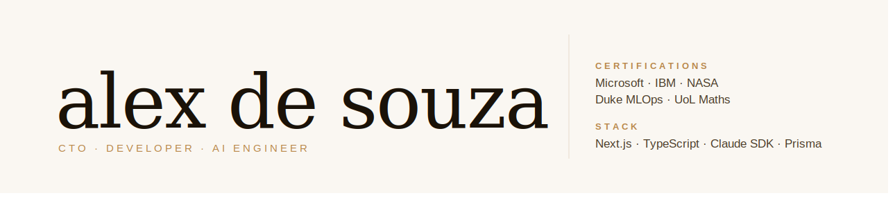

  

<h1 align="center">Alex DeSouza</h1>

  <strong>Full-Stack Developer & AI Engineer · Founder @ ImpulsoLead</strong> 
  Claude SDK · Next.js · SaaS · Microsoft & IBM & NASA Certified 
  ESTGA · Universidade de Aveiro 🇵🇹

  
  
  

---

## About

I build AI-powered B2B SaaS for the Brazilian real estate market.

- 🚀 **Founder & CTO** at [ImpulsoLead](https://impulsolead.com), an AI agent platform that generates ads, captures leads, and qualifies them automatically for real estate agents.
- 🤖 Shipping production systems on the **Anthropic Claude SDK**, **Next.js App Router**, **tRPC**, **Prisma**, and **BullMQ**.
- 🎓 Studying **Systems and Network Programming** at ESTGA, Universidade de Aveiro.
- 🇵🇹 Based near Aveiro, Portugal. Fluent in Portuguese and English.
- ☕ Turning caffeine into production-grade code.

---

## Tech Stack

<table>
  <tr>
    <td valign="top"><strong>Frontend</strong></td>
    <td>
      
      
      
      
    </td>
  </tr>
  <tr>
    <td valign="top"><strong>Backend & Data</strong></td>
    <td>
      
      
      
      
      
      
      
    </td>
  </tr>
  <tr>
    <td valign="top"><strong>AI & ML</strong></td>
    <td>
      
      
      
      
    </td>
  </tr>
  <tr>
    <td valign="top"><strong>Auth & Payments</strong></td>
    <td>
      
      
    </td>
  </tr>
  <tr>
    <td valign="top"><strong>DevOps & Tooling</strong></td>
    <td>
      
      
      
      
    </td>
  </tr>
  <tr>
    <td valign="top"><strong>Languages</strong></td>
    <td>
      
      
      
      
      
    </td>
  </tr>
</table>

---

## Certifications

| Issuer | Certification |
| :--- | :--- |
| 🟦 **Microsoft** | Full-Stack Developer Professional |
| 🟦 **Microsoft** | Cybersecurity Analyst |
| 🔵 **IBM** | Generative AI for Growth Marketing |
| 🟣 **Duke University** | MLOps · Machine Learning Operations |
| 🚀 **NASA** | Open Science 101 |
| 🎓 **University of London** | Essential Mathematics for Computer Science |
| 🏔️ **University of Colorado Boulder** | The Structured Query Language (SQL) |

---

## Currently Building

> 🏢 **[ImpulsoLead](https://impulsolead.com)** · AI agent platform that generates ads, captures leads, and qualifies them automatically for Brazilian real estate agents. Built on Next.js, tRPC, Prisma, BullMQ, and the Claude SDK.

> 🔎 **ImpulsoSearch** · AI-powered semantic real estate search with consultant personas (Sofia, Bruno, Luna, Rafael), powered by pgvector and the Claude SDK.

---

  Designed and built by Alex DeSouza · © 2026 · Open to AI engineering collaborations and real estate tech partnerships

